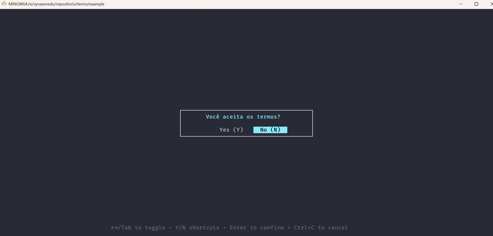

# TermX - Biblioteca Avançada de Interface Terminal para Go

TermX é uma biblioteca TUI poderosa e declarativa que torna a criação de interfaces de linha de comando bonitas sem esforço. Diferente de outras bibliotecas TUI, TermX foca na simplicidade e inclui recursos que você não encontrará em nenhum outro lugar.

## Por que TermX?

- **Sem Arquitetura Elm**: API direta e simples sem padrões complexos Model/Update/View
- **Componentes Integrados**: Tabelas, gráficos, barras de progresso, spinners e muito mais
- **Suporte a Arte ASCII**: Renderize logos e diagramas facilmente
- **Layouts Avançados**: Visualizações divididas, caixas e designs responsivos
- **Atualizações em Tempo Real**: Gráficos dinâmicos, rastreamento de progresso e spinners
- **Tabelas Interativas**: Navegue e selecione de tabelas de dados
- **Composição de Formulários**: Encadeie inputs, selects e confirmações
- **Validação Integrada**: Email, comprimento, campos obrigatórios e validadores customizados
- **Busca/Filtro**: Integrado aos componentes de seleção
- **Sistema de Temas**: Cores e estilos customizáveis

## Instalação

```bash
go get github.com/vynazevedo/termx
```

## Início Rápido

```go
package main

import (
    "fmt"
    "github.com/vynazevedo/termx"
)

func main() {
    var nome string
    var idade int
    var confirmado bool
    
    termx.Form().
        Input("Nome:", &nome).
        Input("Idade:", &idade).
        Confirm("Continuar?", &confirmado).
        Run()
    
    fmt.Printf("Olá %s, idade %d!\n", nome, idade)
}
```

## Screenshots dos Componentes

### Input com Validação


### Seletor com Busca


### Diálogo de Confirmação


### Barra de Progresso


## Recursos Únicos

### 1. Arte ASCII e Logos

```go
termx.ASCII(termx.KubernetesLogo).WithColor("\033[34m").Render()

termx.Box("Status do Servidor", 40, 10).Render()
```

### 2. Tabelas Interativas

```go
tabela := termx.Table([]string{"Nome", "Status", "CPU", "Memória"}).Interactive()
tabela.AddRow("web-01", "Executando", "45%", "1.2GB")
tabela.AddRow("db-01", "Executando", "78%", "3.5GB")

selecionado, _ := tabela.Run()
fmt.Printf("Linha selecionada: %d\n", selecionado)
```

### 3. Gráficos em Tempo Real

```go
dados := []float64{10, 25, 30, 45, 40, 55, 70, 65}
termx.Chart(dados).
    WithStyle("line").
    WithSize(60, 15).
    Render()
```

### 4. Barras de Progresso e Spinners

```go
progresso := termx.Progress(100).WithLabel("Baixando")
for i := 0; i <= 100; i++ {
    progresso.Update(i)
    time.Sleep(50 * time.Millisecond)
}

spinner := termx.Spinner().WithStyle("dots").WithLabel("Processando")
spinner.Start()
time.Sleep(3 * time.Second)
spinner.Stop()
```

### 5. Layouts Divididos

```go
divisao := termx.Split("horizontal").WithRatio(0.3)
divisao.SetLeft(conteudoEsquerda).SetRight(conteudoDireita)
divisao.Render()
```

## Exemplo Completo: Gerenciador Kubernetes

```go
termx.ASCII(termx.KubernetesLogo).Render()

tabela := termx.Table([]string{"Pod", "Status", "Reinicializações", "Idade"})
tabela.AddRow("api-server-abc123", "Executando", "0", "2d")
tabela.AddRow("frontend-def456", "Executando", "2", "5h")
tabela.Render()

var acao string
termx.Select("Ação:", []string{"Escalar", "Reiniciar", "Deletar"}, &acao).Run()
```

## Componentes

### Input
- Entrada de texto com validação
- Mascaramento de senha
- Placeholders
- Validadores customizados

### Select
- Seleção única
- Busca/filtro integrado
- Navegação por setas
- Estilo customizado

### Table
- Estático ou interativo
- Colunas ordenáveis
- Bordas customizadas
- Modo compacto

### Chart
- Gráficos de barras
- Gráficos de linha
- Gráficos de dispersão
- Tamanho customizado

### Progress
- Barras de progresso
- Múltiplos estilos
- Rótulos
- Exibição de porcentagem

### Spinner
- Múltiplas animações
- Rótulos customizados
- Operação assíncrona

### ASCII
- Logos pré-definidos
- Arte customizada
- Desenho de caixas
- Suporte a cores

## Uso Avançado

### Validação de Formulários

```go
termx.Form().
    Input("Email:", &email).
        WithValidator(termx.Email()).
    Input("Senha:", &senha).
        Password().
        WithValidator(termx.MinLength(8)).
    Run()
```

### Temas Customizados

```go
tema := &termx.Theme{
    Primary: "\033[36m",
    Success: "\033[32m",
    Error:   "\033[31m",
}
termx.SetTheme(tema)
```

### Exemplos do Mundo Real

Confira o diretório `example/` para aplicações completas:
- `k8s-manager.go` - Gerenciamento de cluster Kubernetes
- `showcase.go` - Demonstrações de recursos
- `main.go` - Uso básico

## Vantagens Sobre Alternativas

| Recurso | TermX | BubbleTea | tview | termui |
|---------|-------|-----------|-------|--------|
| API Declarativa | ✅ | ❌ | ❌ | ❌ |
| Validação integrada | ✅ | ❌ | ❌ | ❌ |
| Arte ASCII | ✅ | ❌ | ❌ | ❌ |
| Tabelas interativas | ✅ | ⚠️ | ✅ | ⚠️ |
| Gráficos | ✅ | ❌ | ❌ | ✅ |
| Composição de formulários | ✅ | ❌ | ⚠️ | ❌ |
| Progresso/Spinners | ✅ | ⚠️ | ❌ | ⚠️ |
| Busca em selects | ✅ | ❌ | ❌ | ❌ |

## Licença

MIT